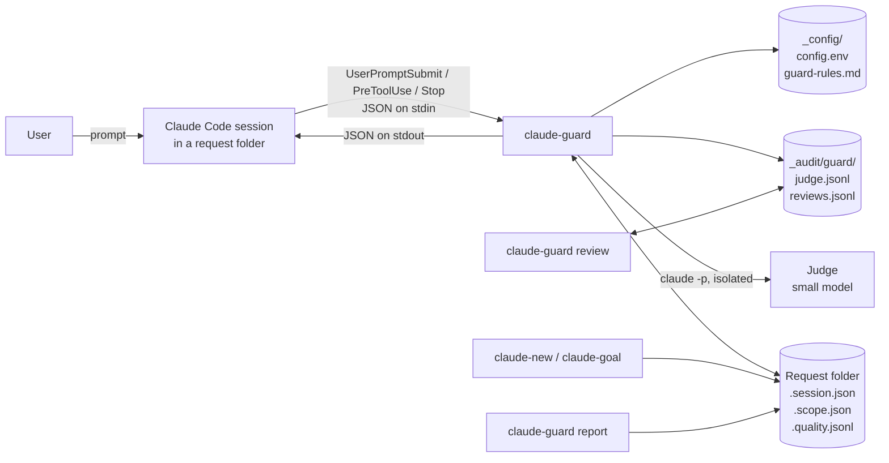
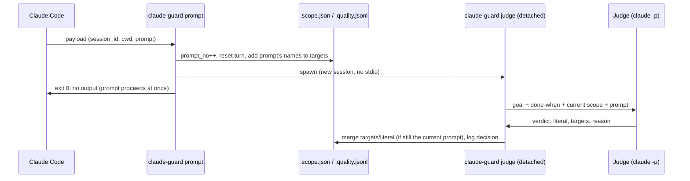
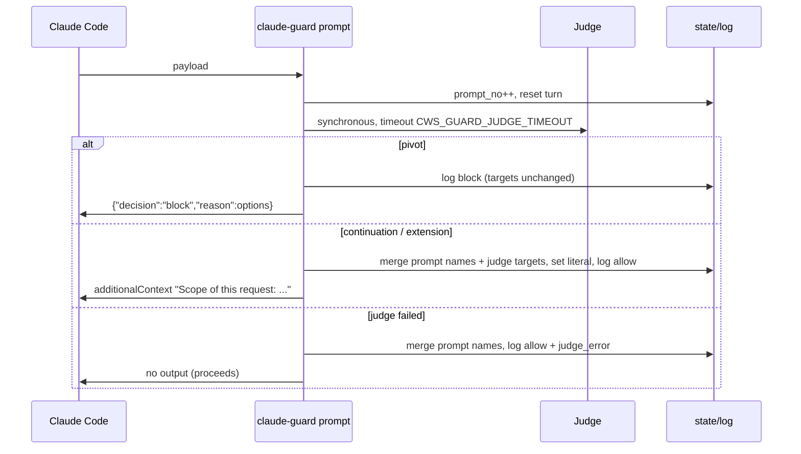

# claude-guard — High-Level Design

| | |
|---|---|
| Component | `claude-guard` (claude-worksessions 2.16.0) |
| Status | Phase 1: implemented, shadow mode |
| Companion documents | [Low-Level Design](lld.md) · [User guide](user-guide.md) |
| Part of | claude-worksessions: [HLD](../hld.md) · [LLD](../lld.md) |

## 1. Problem

Two failure patterns cost the most in long Claude Code sessions:

1. **Over-reach in depth.** A literal request ("list the sources of this model") turns into
   an exploration: the agent opens the sources, then what they depend on, to "give context".
   The answer arrives late, the context window fills with material nobody asked for, and the
   result is harder to check.
2. **Objective pivots.** Mid-session the user moves to a related but different objective
   (fixing one access policy → surveying every access-control mechanism). The earlier
   exploration stays in context and skews the new work; the session's audit trail no longer
   describes one piece of work.

Both depend on judgement *during* the work, which is exactly when neither the user nor the
agent applies it reliably. The rules have to be written in advance and applied
automatically.

## 2. Goals and non-goals

**Goals**

- G1. Hold every request to its literal scope, and have the agent *propose* the next level
  of depth instead of doing it.
- G2. Detect when a prompt starts a new objective, and (in enforce) stop it from running in
  the current session.
- G3. Detect repeated identical tool calls (loops).
- G4. Measure all of this before any enforcement (shadow mode), so the rules can be tuned on
  real sessions.
- G5. Never break a session: every failure lets the action through.
- G6. Stay agnostic to data, platforms and environments. Anything specific to a site lives in
  configuration.

**Non-goals (Phase 1)**

- Automatic child sessions with a hand-off summary (`claude-branch`). A blocked pivot tells
  the user their options; it does not open a new session.
- Reporting guard events in `claude-audit` or the weekly review (Phase 2).
- Checking the *content* of the answer against the request. Only its closing structure is
  checked.
- Guarding sessions that run outside a request folder.

## 3. Design principles

| Principle | How it is applied |
|---|---|
| **The judge is external** | The only LLM decision is made by a separate `claude -p` process on a small model, with no settings, tools, MCP servers or session history. It sees the goal, the current scope and the new prompt, and nothing else. The session's own agent never judges itself. |
| **Deterministic first** | Tool and stop checks are pure rules (regex extraction, set matching, counters). The LLM is used once per non-trivial prompt, where the question is semantic. |
| **Teeth, but only when earned** | Blocking is a mode (`enforce`), reached after a measured shadow period. |
| **Fail open** | An error, timeout, bad JSON or missing file ends as "allow" plus a log line. The hook process always exits 0. |
| **Rules written cold** | The judge's criteria live in `_config/guard-rules.md`, edited outside sessions. |
| **Agnostic** | No data or platform names in code. Extra ignore-lists and rules come from configuration. |

## 4. Context

claude-worksessions already gives every piece of work a **request folder**
(`YYYY/MM/DD/HH-mm-ss_slug/`) with a `.session.json`. The guard builds on it: the folder
defines *which* session is being guarded and holds the guard's state and log. Sessions
outside a request folder are not guarded.

Claude Code calls the guard through three documented hook events. Hook commands receive a
JSON payload on stdin and answer with JSON on stdout (spec: https://code.claude.com/docs/en/hooks).

## 5. Components

| Component | Responsibility |
|---|---|
| `bin/claude-guard prompt` | `UserPromptSubmit` hook. Classifies the prompt (override, trivial, go-deeper, needs a judge), keeps the request's *contract* (literal scope + targets) in `.scope.json`, runs the judge, and in enforce blocks pivots. |
| `bin/claude-guard tool` | `PreToolUse` hook on reading tools (`Read`, `Glob`, `Grep`, `WebFetch`, `WebSearch`, `Bash`, `mcp__*`). Extracts what the call reaches, compares it with the targets, counts repeats. In enforce, denies out-of-scope calls and loops. |
| `bin/claude-guard stop` | `Stop` hook. After an investigation, checks that the answer ends with next-level proposals. In enforce, asks once for them. |
| `bin/claude-guard judge` | Internal. The background half of a prompt check in shadow mode. |
| `bin/claude-guard report` | Summary of `.quality.jsonl` across the work root, for review and tuning, plus how many judge decisions were reviewed and which were wrong. |
| `bin/claude-guard review` | Lists the judge's decisions from the central journal and records the user's `right`/`wrong` mark and note on each. The learning loop for `guard-rules.md`. |
| Judge | `claude -p` on `CWS_GUARD_MODEL` (default `haiku`) under `CWS_GUARD_PROFILE` (default: the session's profile), with a JSON schema for its output. Verdict: `continuation`, `extension` or `pivot`, plus literal scope and targets. |
| `claude-new` (shell) | Records `goal` and `done_when` in `.session.json`. |
| `claude-goal` (shell) | Re-anchors a folder's goal: history, scope reset, log line. |
| `install.sh` / `uninstall.sh` | Register and remove the hooks in every profile's `settings.json`; seed `_config/guard-rules.md`. |

## 6. Main flows

### 6.1 Prompt — shadow mode

### 6.2 Prompt — enforce mode

### 6.3 Tool call

The call is hashed; a third identical call in one request is a **loop**. The identifiers the
call reaches (paths, including `./` and `../` ones, URLs, three-part dotted names, search
queries; not the text of commit or PR messages) are extracted. Those in safe places (the
session folder, the scratchpad, temp dirs, Claude's config dirs) are ignored. A path is also in
scope when it's in a folder the request declares (`--path`), in a git repo Claude has edited in
this session, or in a git repo named in the goal or a prompt. The rest are matched loosely
against the targets; a path matching nothing is outside even before the judge has answered. Unmatched ones are
**out of scope**, logged once per request. In enforce, the call is denied with a reason that
tells the agent to list it as a next step.

### 6.4 Stop

If the request made two or more reading calls and the last answer does not end with
next-level proposals (a phrase such as "next step", "want me to", or a closing question),
the stop is logged as `depth`. In enforce, Claude is asked once to add them.
`stop_hook_active` prevents a second block.

## 7. Data

| Artifact | Owner | Content |
|---|---|---|
| `.session.json` | `claude-new`, `claude-goal` | adds `goal`, `done_when`, `goal_history[]` |
| `.scope.json` | `claude-guard` | per session id: prompt counter, literal scope, targets, go-deeper flag, current request's counters |
| `.quality.jsonl` | `claude-guard`, `claude-goal` | one JSON line per decision: `ts`, `event`, `decision`, `type`, `initiated_by`, `reason`, event-specific fields |
| `_audit/guard/judge.jsonl` | `claude-guard` | every judge decision across the work root, complete: what the judge saw (goal, done-when, scope before, prompt) and said (verdict, literal, targets, reason), with model, profile, time and whether it was enforced |
| `_audit/guard/reviews.jsonl` | `claude-guard review` | the user's `right`/`wrong` mark and note per decision id; the latest mark wins |
| `_config/guard-rules.md` | user | the judge's system prompt |
| `_config/config.env` | user | `CWS_GUARD_MODE`, `CWS_GUARD_MODEL`, `CWS_GUARD_PROFILE`, `CWS_GUARD_JUDGE_TIMEOUT`, `CWS_GUARD_IGNORE_NAMES` |

All state lives in the request folder, which is usually in a synced folder (OneDrive, iCloud) along with the rest of the
work, so the audit trail stays next to the work it describes.

## 8. Modes

| Mode | Prompt | Tool | Stop | Judge |
|---|---|---|---|---|
| `off` | — | — | — | not called |
| `shadow` | log only | log only | log only | background, no delay to the user |
| `warn` | log; a one-line notice to the user on a pivot | log; a notice on a new out-of-scope read or a loop (the call goes ahead) | log; a notice when next steps are missing | background, no delay; its verdict is shown at the next tool call, end of answer or prompt |
| `enforce` | blocks pivots; injects the literal scope | denies out-of-scope calls and loops | asks once for proposals | synchronous, bounded by the timeout |

In every mode, `decision` in the log is what **enforce** does (or would do), so shadow
data shows directly what enforcement would have blocked.

## 9. Key design decisions

| # | Decision | Alternatives | Rationale |
|---|---|---|---|
| D1 | Override prefix `force:` | `!force` (handoff) | A leading `!` runs a shell command in Claude Code and never reaches the hook. |
| D2 | Judge runs detached in shadow | synchronous always; hook `async: true` | Measured at 7–11 s per call. Shadow must not cost the user time. Doing it in the script keeps one hook registration for both modes; switching mode is just a config change. |
| D3 | Three verdicts (`continuation`, `extension`, `pivot`) | two | With two, "apply it to one more schema" was classified as a pivot. Extension is allowed and grows the targets. |
| D4 | Judge isolation: `--settings '{"disableAllHooks": true}'`, `--strict-mcp-config`, `--tools ""`, `--no-session-persistence`, custom system prompt, cwd = temp dir, env `CWS_GUARD_JUDGE=1` | `--bare`; `--setting-sources ""` | `--bare` does not use the OAuth login of subscription profiles; `--setting-sources ""` drops the gateway URL and token a gateway profile keeps in its settings. Loading the profile's settings with all hooks disabled keeps authentication working on both, with no hooks (no recursion), tools, MCP or transcript. The env var is a second recursion guard. |
| D5 | No LLM on tool calls | judge each call | Tool calls are frequent. 10 s each is unacceptable, and the question (is X among the targets?) is mechanical once the targets are known. |
| D6 | Loose matching (substring either way, same last segment) | exact | False positives erode trust faster than false negatives. Shadow data will show where to tighten. |
| D7 | State keyed by session id in one `.scope.json`, with `flock` | one file per session | Several sessions can share a request folder, and the handoff named `.scope.json`. The lock makes the background judge and the tool hook safe to interleave. |
| D8 | In enforce, the prompt's names join the targets only after the verdict | immediately | A blocked pivot must not widen the scope it was blocked from. |
| D9 | `CWS_` prefix for config keys | `GUARD_MODE` | Matches every other claude-worksessions setting; environment overrides work the same way. |
| D10 | A central judge journal in `_audit/guard/`, besides the per-folder log | per-folder log only | Reviewing and learning happen across sessions. One file holding the judge's full input and output makes each decision reviewable on its own and gives a labelled set for tuning the rules. `_audit/` is already the infrastructure folder for audit data. |
| D13 | A `warn` mode between shadow and enforce | only shadow and enforce | Shadow is invisible, so trying the guard felt like nothing happened; enforce gets in the way. Warn shows what enforce would do, as a UI message Claude doesn't see, with no added delay |
| D14 | Extensions add up: past `CWS_GUARD_MAX_EXTENSIONS` (2) per goal, one more is a pivot; a different product or platform is a pivot, not an extension | judge each prompt alone | Seen in testing: "Databricks API" → Snowflake → SQL Server were three extensions, each allowed. Drift is a property of the sequence, not of one prompt |
| D12 | The request's scope is its folder, plus repos it **edits**, repos it **names** and folders it **declares** | a global list of allowed folders; any git repo | Measured in shadow: most false flags were reads of the repo the work was in. Edits and names follow the work itself; a declaration covers the rest; a global list would let every session read everywhere |
| D11 | Configurable judge profile (`CWS_GUARD_PROFILE`) | always the session's profile | Keeps the judge's authentication, endpoint and cost under the user's control, for example judging every session on one profile's subscription. The session's profile stays the default. |

## 10. Non-functional characteristics

| Aspect | Value / approach |
|---|---|
| Latency — tool hook | ~36 ms per call (local, no network) |
| Latency — prompt hook, shadow | a few ms (spawns and returns) |
| Latency — prompt hook, enforce | judge time, measured 7–11 s; bounded by `CWS_GUARD_JUDGE_TIMEOUT` (default 25 s) under the hook timeout (30 s) |
| Cost | ~$0.004 per judged prompt on Haiku with the default rules |
| Reliability | fail open on every path; the process always exits 0; stderr gets diagnostics |
| Concurrency | `flock` on `.scope.json`; `.quality.jsonl` is append-only, one line per write; late verdicts are applied only if their prompt is still current |
| Privacy | the judge receives the goal, done-when, current literal scope and the prompt (first 4,000 chars) through the same profile and endpoint the session uses; no transcript is persisted for it |
| Portability | Python 3 standard library, POSIX `fcntl` (macOS, Linux) |

## 11. Risks and limitations

| Risk | Mitigation |
|---|---|
| Out-of-scope false positives (supporting reads, docs, code needed to answer) | Loose matching, safe roots, "go deeper" escape, shadow period, `CWS_GUARD_IGNORE_NAMES`. The report shows each flag with what was reached. |
| Targets only known after the judge returns (shadow, first seconds of a request) | The prompt's own names are added at once. With no targets at all, nothing is flagged. |
| Judge misclassification | Rules are editable. Shadow logs the reason for every verdict, and `force:` / `claude-goal` override in enforce. |
| Judge unavailable on a profile (not logged in, gateway without the model) | Fail open with `judge_error` logged; the report counts failures. |
| Enforce adds ~10 s to every non-trivial prompt | Measured in shadow (`judge_ms`). A decision for Phase 2: skip the judge when the prompt's names already fall inside the targets. |
| Keyword lists are English/Portuguese | Language, not data; candidates for configuration. |

## 12. Rollout

1. **Phase 1 — shadow (1–2 weeks).** `CWS_GUARD_MODE=shadow`. Mark the judge's decisions
   with `claude-guard review`, and read `claude-guard report`: judge agreement, pivot precision,
   out-of-scope false-positive rate, loop count, judge latency and failures. Tune
   `guard-rules.md` from the decisions marked wrong, and `CWS_GUARD_IGNORE_NAMES`.
2. **Enforce.** `CWS_GUARD_MODE=enforce` once the flags are mostly right.
3. **Phase 2.** Blocks, pivots and overrides in `claude-audit` / weekly review. `claude-branch`
   to open a child session with a hand-off (conclusions, discarded paths and why, open
   questions — never the path taken). Cheaper prompt check (see §11).
