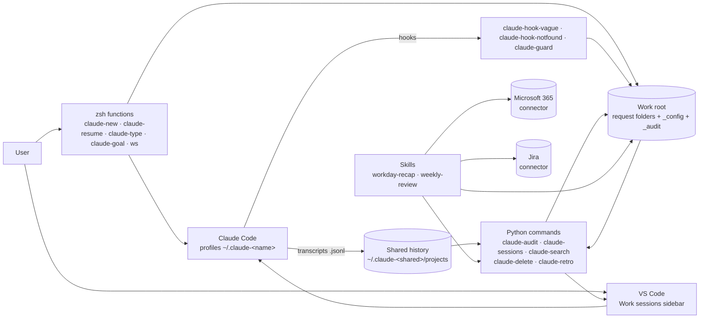
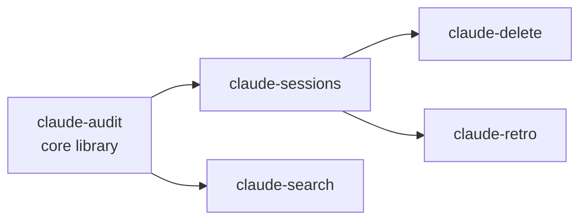
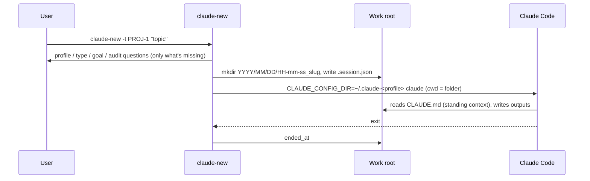
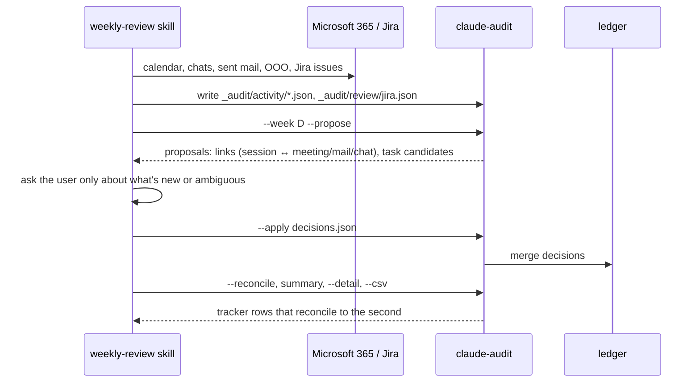
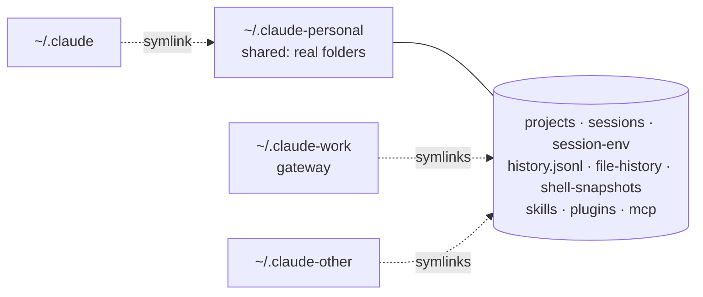

# claude-worksessions — High-Level Design

| | |
|---|---|
| System | claude-worksessions |
| Version | 2.16.1 |
| Companion documents | [Low-Level Design](lld.md) · [User guide](user-guide.md) · [claude-guard HLD](guard/hld.md) |

## 1. Purpose

claude-worksessions turns Claude Code from a tool you open anywhere into an organised,
accountable way of working. Every piece of work gets its own dated folder with its metadata.
Several Claude accounts share one history. Time, search, daily and weekly reporting are
rebuilt from what Claude already records, and guard rails keep sessions on the request they
were given. Nothing needs maintaining by hand.

## 2. Goals and non-goals

**Goals**

| # | Goal |
|---|---|
| G1 | One folder per request (`YYYY/MM/DD/HH-mm-ss_slug/`), created with its ticket, profile, task type and goal, so every piece of work is findable and attributable. |
| G2 | Several Claude profiles (subscriptions, inference gateways) that share one history, skills and MCP configuration. |
| G3 | An audit of time worked per day, week and month, per ticket and task type, derived from the transcripts, with no timers. |
| G4 | Search across every past session, with the command to resume it. |
| G5 | Daily recap and weekly tracker filled from Claude sessions plus Teams, calendar, mail and Jira, with human decisions remembered in a ledger. |
| G6 | Guard rails on how Claude works: ask when vague, stop when something doesn't exist, stay on the request. |
| G7 | A VS Code sidebar over the same data, with each session in its own tab and profile. |
| G8 | One config file per user, in a synced work root, so the setup moves between machines. |
| G9 | Agnostic to the user's data, platforms and organisation. Anything specific lives in configuration. |

**Non-goals**

- Running or replacing Claude Code. The system wraps and configures it and reads its files.
- Writing to Jira, Teams, mail or calendars. The skills read them; outputs are local files and the clipboard.
- A server or shared database. Everything is local files plus a synced folder.
- Multi-user use. One person's work root, profiles and history.

## 3. Context

**External dependencies**

| Dependency | Used for |
|---|---|
| Claude Code (CLI) | the agent; its transcripts, hooks, settings and headless mode (`claude -p`) |
| zsh | the shell functions and installer |
| Python 3 (standard library only) | every command in `bin/` except the VS Code wrapper |
| fzf | `ws` |
| pandoc | `claude-md-email`, yazi's HTML opener |
| yazi, glow (optional) | file browsing and Markdown preview |
| VS Code + `code` CLI (optional) | the sidebar extension, and the Claude extension's process wrapper |
| Claude connectors: Microsoft 365, Atlassian | the recap and review skills |
| A synced folder (OneDrive, iCloud) | the work root, so config and outputs follow the user |

## 4. Architecture

### 4.1 Layers

| Layer | Components | Responsibility |
|---|---|---|
| **Entry** | `claude-new`, `claude-resume`, `ws`, VS Code sidebar | start and resume work in the right folder with the right profile |
| **Metadata** | `.session.json`, `claude-type`, `claude-goal` | what a request is: ticket, profile, task type, goal, audit flag |
| **Agent configuration** | profiles, `install.sh`, rendered `CLAUDE.md` and skills, hooks | how Claude runs: which account, which standing context, which rules |
| **Guard rails** | `claude-hook-vague`, `claude-hook-notfound`, `claude-guard` | live checks on prompts and tool calls |
| **Derived data** | `claude-sessions`, `claude-audit`, `claude-search`, `claude-retro` | read-only views over transcripts and folders |
| **Decisions** | weekly-review skill, `claude-audit --propose/--apply`, ledger | human decisions recorded once and reused |
| **Housekeeping** | `claude-delete`, bin | remove noise safely and reversibly |
| **Output** | `claude-md-email`, CSV exports, reports | share results |

### 4.2 Components

| Component | Kind | Role |
|---|---|---|
| `shell/worksessions.zsh` | zsh, sourced from `~/.zshrc` | `claude-new`, `claude-resume`, `claude-type`, `claude-goal`, `ws`, `y`; loads the config; makes a bare `claude` use the default profile |
| `install.sh` / `uninstall.sh` | zsh | set up and remove everything outside the repo: config, work root, profiles, hooks, links, VS Code, skills, yazi, `~/.zshrc` block |
| `bin/claude-audit` | Python | the core library and the time audit: transcripts → sessions → subjects → tracker rows; the ledger |
| `bin/claude-sessions` | Python | session list, and the JSON feed for the sidebar (sessions, requests, files, deletability) |
| `bin/claude-search` | Python | BM25 search over an incremental index, with ticket evidence and optional Claude re-ranking |
| `bin/claude-delete` | Python | value check, move to a restorable bin, restore, purge |
| `bin/claude-retro` | Python | friction signals in transcripts, judged by Claude; report and trend |
| `bin/claude-guard` | Python | scope, pivot and loop checks as hooks, with a judge and journal ([design](guard/hld.md)) |
| `bin/claude-hook-vague`, `bin/claude-hook-notfound` | Python | prompt-quality hooks |
| `bin/claude-md-email` | Python | Markdown → inline-styled HTML on the clipboard |
| `bin/claude-vscode` | zsh | process wrapper that gives the VS Code Claude extension the request's profile |
| `vscode/` | JavaScript extension | the Work sessions sidebar |
| `skills/workday-recap`, `skills/weekly-review` | Claude skills | recap a day, fill the weekly tracker |
| `templates/CLAUDE.md.tmpl` | template | the standing instructions every session reads |

### 4.3 Code reuse between commands

The Python commands share code without packaging. Each loads a sibling script as a module
with `SourceFileLoader`, looking next to its own real path first and then in `~/.local/bin`:

`claude-audit` owns configuration loading, transcript discovery, `.session.json` reading, moved
folders, the no-audit list, the ledger and the shared text utilities. `claude-guard`, the
hooks, `claude-md-email` and `claude-vscode` are independent.

## 5. Data

### 5.1 Stores

| Store | Location | Written by | Read by |
|---|---|---|---|
| Config | `<work root>/_config/config.env` (linked from `~/.config/claude-worksessions/config.env`) | `install.sh`, the user | everything |
| Standing context | `_config/context.md` → inlined into `<work root>/CLAUDE.md` | the user, `install.sh` | every Claude session |
| Request folder | `YYYY/MM/DD/HH-mm-ss_slug/` | `claude-new`, Claude, the user | everything |
| Request metadata | `<request>/.session.json` | `claude-new`, `claude-type`, `claude-goal`, the sidebar | audit, sessions, search, delete, guard, `claude-vscode` |
| Transcripts | `~/.claude-<shared>/projects/<encoded cwd>/<id>.jsonl` | Claude Code | audit, sessions, search, delete, retro |
| Activity | `_audit/activity/YYYY-MM-DD.json` | the recap and review skills | `claude-audit`, `claude-search` |
| Review ledger | `_audit/review/ledger.json` | `claude-audit --apply` only | audit, search, delete |
| Jira cache | `_audit/review/jira.json` | weekly-review skill | audit, search |
| Moved folders | `_audit/moved-folders.json` | the user, when folders move | audit, sessions, search |
| Session → folder | `_audit/session-folders.json` | the user | audit, sessions |
| No-audit list | `_audit/no-audit.txt` | the user | audit, sessions |
| Exports | `_audit/claude-audit_*.csv`, `_daily/*.md`, `_audit/quality/*` | audit, recap, retro | the user |
| Guard state and journal | `<request>/.scope.json`, `.quality.jsonl`; `_audit/guard/*.jsonl` | `claude-guard`, `claude-goal` | `claude-guard report/review` |
| Pins | `_config/pinned.json` | the sidebar | the sidebar, `claude-delete` |
| Bin | `~/.local/share/claude-worksessions/trash/` | `claude-delete` | `claude-delete`, the sidebar |
| Caches | `~/.cache/claude-worksessions/written.json`; `~/.claude-session/cache/search-index.json` | sessions, search | the same |

### 5.2 Data principles

- **Derive, don't record.** Time, sessions, files written and search results are rebuilt from
  the transcripts on every run. The only hand-kept data is what can't be derived: ticket, type
  and goal (`.session.json`) and review decisions (the ledger).
- **One writer per store.** The ledger changes only through `claude-audit --apply`; activity
  files only through the skills; `.session.json` only through the shell functions and the
  sidebar's set-type.
- **Synced versus local.** The work root is synced: config, requests, audit data, pins. The
  transcripts, bin and caches are local, and the transcripts' retention is set to 10 years
  (`cleanupPeriodDays`), because they are the audit trail.
- **Stable identities.** Subjects, events and tracker rows get content-derived ids
  (`sha1` prefixes), so decisions carry across weeks.

## 6. Key flows

### 6.1 Start a request

### 6.2 Audit and weekly review

### 6.3 A session in VS Code

The sidebar runs `claude-sessions -a --json`, and refreshes on file-watcher events (1.5 s
debounce) under the shared `projects` folder and the work root. Opening a session starts an
editor terminal running `claude-resume -p <profile> --resume <id>` in the request folder. A
Claude extension window opened on a request folder gets the request's profile from the
`claude-vscode` wrapper.

### 6.4 Guard rails during a session

Claude Code calls the hooks: `claude-hook-vague` and `claude-guard prompt` on each prompt,
`claude-guard tool` before reads, `claude-hook-notfound` after commands and MCP calls, and
`claude-guard stop` at the end of each answer. See [claude-guard HLD](guard/hld.md).

## 7. Profiles

Each profile is its own Claude Code config folder with its own login or gateway `env`,
settings and hooks. The **shared** profile owns the history-bearing folders; every other profile
links to them. So any session can be resumed, searched and audited from any profile, and skills
are rendered once. Which profile ran a session comes from `.session.json`, not from where its
transcript sits (they all sit in the shared folder).

## 8. Design decisions

| # | Decision | Alternatives | Rationale |
|---|---|---|---|
| D1 | A dated folder per request, named by local time without colons | one folder per ticket; free-form | chronological browsing; OneDrive rejects colons; a request is the unit of work, not the ticket |
| D2 | Metadata in a small `.session.json` next to the work | a central database | travels with the folder, survives moves, readable by every tool and by Claude |
| D3 | Time derived from transcript timestamps, with gaps capped | timers; calendar blocks | no discipline required; capped gaps (5 min in a turn, 2 min between) avoid counting idle time |
| D4 | Profiles as separate config dirs sharing history by symlink | one account; separate histories | different billing and endpoints per piece of work, one searchable history |
| D5 | Standard-library Python, scripts loading scripts | a package with dependencies | install is a symlink; nothing to pip-install; runs on the system Python |
| D6 | Human decisions in a ledger changed only by `--apply` | editing the tracker directly | decisions are made once and replayed; weeks can be regenerated |
| D7 | Skills do the connector work; commands stay offline | commands calling Microsoft 365 or Jira APIs | no credentials in the tool; connectors come with the Claude account |
| D8 | Standing context inlined into the work root's `CLAUDE.md` | `@import` | a parent `@import` isn't expanded for sessions in sub-folders, which is where every session runs |
| D9 | Hooks registered per profile, fail-open, deduplicated by command | a plugin | works with any Claude Code install; never blocks a session on its own failure |
| D10 | Sidebar data from a CLI (`claude-sessions --json`) | the extension reading transcripts itself | one implementation of the parsing, testable in Python |
| D11 | Deletion to a local bin with a manifest | `rm` | reversible; refuses anything with value |
| D12 | Releases from `VERSION` on `main` | manual tags | a merge that bumps `VERSION` is the release; the changelog section is required |

## 9. Non-functional characteristics

| Aspect | Approach |
|---|---|
| Portability | macOS, Linux, WSL. OS detection in the installer, `claude-md-email`, `ws -o`. Package managers: Homebrew, apt, dnf, pacman, zypper |
| Idempotency | every install step checks state first; anything replaced is backed up as `*.bak-<timestamp>`; CI re-runs the installer and requires "up to date" |
| Safety | the installer never deletes profiles or data; `claude-delete` refuses anything booked, open, recent or with artifacts; hooks fail open |
| Privacy | everything local or in the user's synced folder; the only network calls are Claude's own (`claude -p` for search re-ranking, retro and the guard judge) and the skills' connectors |
| Performance | incremental caches for written files and the search index; the sidebar debounces refreshes; the guard's tool hook is ~36 ms |
| Testability | ~330 pytest tests plus node tests for the extension; a 95 % coverage gate on `bin/`; zsh tested by running it; a real Linux install in CI |
| Upgrades | `install.sh --update` moves the checkout to the newest release tag, prints the changelog gained and re-renders; `bin/` and `shell/` follow the checkout immediately |

## 10. Constraints and assumptions

- One user, one work root. The work root may be synced; the transcripts are not.
- Claude Code's transcript format (`type`, `timestamp`, `promptId`, `ai-title`, `cost-state`…)
  and hook contract are relied on as documented or observed; changes upstream may need
  adaptation.
- Local time is the machine's time zone; there's no per-user zone override in the audit.
- Rendered files (`CLAUDE.md`, skills, yazi config) change only when `install.sh` runs.

## 11. Risks

| Risk | Mitigation |
|---|---|
| Claude Code changes its transcript or hook format | parsing is defensive (bad lines skipped); tests pin the fields used |
| Transcripts deleted by retention | installer sets `cleanupPeriodDays` to 3650 and warns on shorter values |
| A folder moved or renamed breaks attribution | `_audit/moved-folders.json` maps old to new paths for every reader |
| Profile misattributed | profile comes only from `.session.json`; sessions should start with `claude-new` |
| Sync conflicts on shared files (pins, ledger) | small files, atomic local writes; single user |
| Hook misbehaviour interrupts work | every hook fails open; the guard ships `off` and has a shadow mode |

## 12. Evolution

Planned or open, from the component designs and the issue tracker: guard enforce mode and child
sessions with hand-off (`claude-branch`); guard events in the audit and weekly review; sidebar
ideas (active sessions, request size, retro in the sidebar). Known limitations per component are
listed in the [LLD](lld.md#15-known-limitations).
